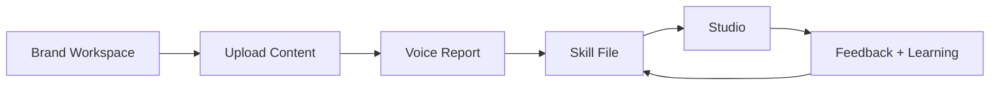
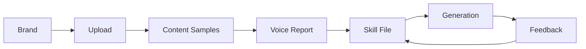

# Spool Full App Rebrand Design

Date: 2026-04-29

## Goal

Rename and redesign the current Voice Skill File for Twitter/X product into **Spool**, a tactile creator/social voice studio for posts, threads, and launches.

The redesign should reach the visual quality of the Trove brand kit while staying usable as a real product. Spool should feel warm, editorial, and print-made, but the workflow labels, actions, forms, and app surfaces must remain clear enough that users do not have to guess what to do.

## Approved Direction

The approved name is **Spool**.

The approved wordmark direction is title-case **Spool** with a thread/spool mark. It should feel like an ownable sibling to Trove rather than a Trove sub-brand.

The approved visual direction is **Riso Studio**:

- Warm paper background: `#f1e6cc`
- Light paper panels: `#fef7e3`
- Deep teal ink: `#1a3540`
- Fluorescent orange action ink: `#ff5728`
- Forest success ink: `#1f7a3f`
- Fraunces for display and wordmark moments
- Inter for product UI text
- IBM Plex Mono for labels, metadata, stamps, and route chrome
- Paper grain and light halftone texture
- Hard offset shadows with no blur
- Thin ink borders, dashed dividers, and stamped status labels

Visual thesis:

> A tactile print-studio interface for turning real writing into reusable social voice.

## Product Positioning

Spool should be creator/social focused:

> Build a reusable voice engine for posts, threads, and launches.

The app can still support the current Twitter/X archive and tweet generation workflow, but the top-level product language should not make Spool feel permanently limited to Twitter/X. In working surfaces, use precise labels where needed: tweets, tweet type, Twitter/X archive, posts, drafts, skill file, voice report, and provider settings.

Avoid clever workflow names when clear labels are better. The user explicitly approved keeping **Upload Content** because it is obvious.

## Non-Goals

This rebrand does not change:

- database schema
- Prisma models
- LLM provider logic
- generation, analysis, evaluation, retrieval, or feedback algorithms
- authentication
- billing
- posting or scheduling to social platforms
- multi-platform ingestion

This is a UI, copy, and design-system refactor over the existing Next.js app.

## App Structure

Keep one cohesive app shell across every route.

Primary shell:

- Top masthead with the Spool wordmark on the left.
- Mono navigation/actions on the right.
- Paper background across the entire app.
- Constrained workspace width for routine product pages.
- No generic white SaaS header.
- No oversized decorative card shell around the whole app.

Primary workflow:

Approved page labels:

- Home workspace list: **Brand workspaces**
- Upload route: **Upload Content**
- Voice report route: **Voice Report**
- Skill file route: **Skill File**
- Tweet Studio route: **Studio**
- Settings route: **Provider Settings**

## Screen Designs

### Home

Home should be a working product entry screen, not a marketing splash.

It should include:

- A full-width Spool masthead area.
- Large Spool wordmark and thread mark.
- A direct promise about building a reusable voice engine for posts, threads, and launches.
- Primary orange action: **Create Brand Voice Workspace**.
- Existing workspaces below as printed rows or clipped plates, not generic SaaS cards.
- Empty state copy that directly tells users to create a workspace.

The first screen should make the new brand unmistakable. The user should understand the product by scanning the wordmark, promise, and CTA.

### Brand Dashboard

The brand dashboard is the control room for one voice workspace.

It should show:

- Brand name and handle/category.
- Current stage and recommended next action.
- Useful sample count.
- Latest upload status.
- Voice report status.
- Skill file version.
- Voice health and corpus-backed status.
- Short brand context, beliefs, and avoid-sounding-like notes.
- Direct actions to Upload Content, Voice Report, Skill File, and Studio.

Use printed dividers, compact metric blocks, and stamps. Reduce generic bordered-card repetition where a section header, divider, or compact row is enough.

### Upload Content

The Upload Content page should stay plain-spoken and task-first.

It should include:

- Brand context at the top.
- Clear heading: **Upload Content**.
- Existing upload form with Spool input/button styling.
- A readiness callout when useful samples are available.
- Recent uploads table with strong readability, clear status, useful/excluded counts, summaries, and delete actions.

Do not rename this page to something clever such as "Collect writing." Users should never wonder where to upload their archive.

### Voice Report

Voice Report should feel like an analysis printout.

It should include:

- Clear heading: **Voice Report**.
- One-sentence explanation: turn useful writing samples into a structured report and reusable Skill File.
- Analyze panel restyled as a printed work surface.
- Report sections with strong headings, short summaries, and compact evidence/details.
- Error and loading states that look like Spool status stamps but remain readable.

### Skill File

Skill File should present the artifact as the reusable voice object.

It should include:

- Clear heading: **Skill File**.
- Latest version and voice health.
- CTA to open Studio.
- JSON editor with improved contrast, mono treatment, and no decorative clutter.
- Version diff treatment that reads like a practical change record.
- Empty state that points users to Voice Report.

### Studio

Studio is the hero working surface of the full app.

It should include:

- Clear heading: **Studio**.
- Left generation panel:
  - provider mode
  - voice evidence
  - raw idea or context
  - tweet type
  - variations
  - optional notes
  - generate CTA
- Right review desk:
  - empty state for generated drafts
  - draft plates with output text
  - score stamp
  - reason and issues
  - score breakdown
  - style distance
  - evidence/provenance when available
  - revision note controls
  - feedback buttons

The Studio should be dense but calm. Generated drafts must remain easy to read. Scores and feedback controls should be visually strong without overpowering the text.

### Provider Settings

Provider Settings should stay utility-first.

It should include:

- Clear heading: **Provider Settings**.
- BYOK explanation with no ambiguity about localStorage.
- Existing provider configuration fields with Spool styling.
- Clear save/status/error states.

## Components And Design Units

The implementation should introduce a small design layer instead of scattering one-off classes everywhere.

Recommended design units:

- Spool wordmark component or reusable markup.
- App masthead.
- Page header.
- Section label or mono eyebrow.
- Primary button and secondary button styles.
- Status stamp style.
- Printed plate style for repeated interactive surfaces.
- Metric block style.
- Table style.
- Form field style.

These units should be simple and local to the existing app. Do not introduce a heavy component library.

## Data Flow

No product data flow changes are required.

Existing data flow remains:

Routes should continue to fetch data through existing Prisma queries. Client components should continue to call existing API routes. Provider settings should continue to use browser localStorage as currently implemented.

## Error Handling And States

Keep all current behavioral error handling. The rebrand should make states clearer, not change their semantics.

State treatment:

- Loading: simple text state inside the action or panel, optionally paired with a small mono status stamp.
- Error: orange or weak ink status with readable text and enough contrast.
- Empty: direct next action, not atmospheric copy.
- Disabled: lower opacity, visible text, no layout shift.
- Success/ready: forest ink or teal status, with explicit next action.

Avoid hiding errors in decorative elements. Error copy should still read like product UI.

## Accessibility And Responsiveness

The visual style must not reduce usability.

Requirements:

- Maintain strong contrast between text and paper backgrounds.
- Keep button tap targets comfortable on mobile.
- Ensure all form labels remain visible and clear.
- Keep generated draft text readable at desktop and mobile widths.
- Use responsive grids that collapse cleanly.
- Avoid text overlap in buttons, stamps, and metric blocks.
- Keep letter spacing at `0` for normal body text. Mono labels can use restrained uppercase tracking.
- Respect reduced motion if motion is added.

## Motion

Motion should be restrained and product-relevant.

Preferred motion:

- Subtle masthead/hero entrance on Home.
- Button press states that move hard-shadow elements by a few pixels.
- Hover/reveal states for workspace rows and draft plates.
- Loading/status transitions in Studio and analysis workflows.

Do not add ornamental animation that distracts from writing, scoring, or reviewing drafts.

## Testing And Verification

Use practical verification for a UI rebrand:

- `npm run build`
- `npm test`
- lint command if available in the installed Next.js setup
- Browser verification at desktop and mobile widths for:
  - Home
  - New brand page
  - Brand dashboard
  - Upload Content
  - Voice Report
  - Skill File
  - Studio
  - Provider Settings

Visual checks:

- Spool wordmark is unmistakable on first screen.
- Paper texture renders without making text noisy.
- Buttons and inputs are clear and usable.
- Tables remain readable.
- Draft review surfaces do not feel like generic SaaS cards.
- No text overlaps on mobile.
- The app still works with existing database/API behavior.

## Acceptance Criteria

The rebrand is complete when:

- All visible product metadata and top-level UI refer to Spool.
- The app uses the approved Riso Studio visual system.
- Workflow labels remain plain and user-friendly.
- Existing core flows still work:
  - create brand workspace
  - upload content
  - analyze voice
  - inspect Skill File
  - generate drafts in Studio
  - revise/save feedback where provider setup allows
- Existing tests and build pass or any unrelated environmental blockers are documented.
- Browser verification confirms desktop and mobile layouts are readable and non-overlapping.
